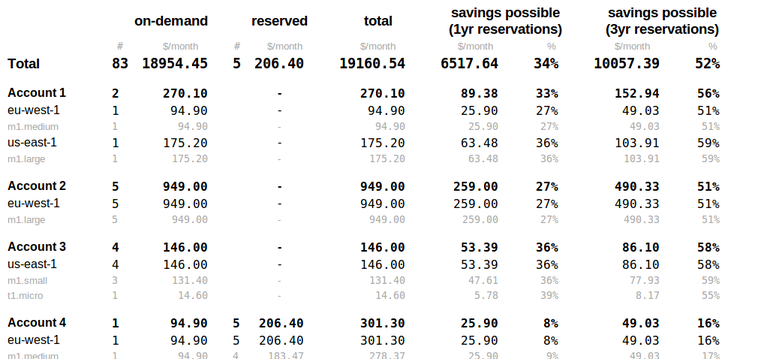

Accumulus
=========
Amazon EC2 cost calculator.

- Works out current costs and savings that can be achieved using reserved instances.

running
-------

Copy settings.yml.example to settings.yml and fill out your account(s).

Run:

    $ ./accumulus.py
    $ google-chrome bill.html

Alternatively you could cron this, and mail the results daily:

    $ mutt -a bill.html -- -s 'accumulus report' mail@example.com

limitations
-----------

- Only models 100% usage (Heavy utilization).
